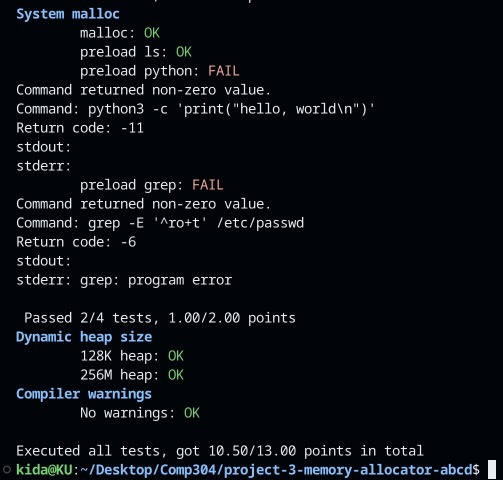

# COMP 304 - Custom Memory Allocator 

## Introduction
This report provides an overview and analysis of the custom memory allocator code implemented in the `alloc.c` file.

## Code Overview
The code implements a basic memory allocator using a linked list of free blocks. The allocator maintains a global variable `head` that points to the head of the free block list. The code includes debugging statements (`print` variable) that can be enabled for debugging purposes. The code consists of several functions that implement a memory allocator. Here is a brief description of each function:

1. `kumalloc(size_t size)`: This function is responsible for allocating memory of the specified size. It searches for a free block in the heap and returns a pointer to the allocated memory.

2. `kucalloc(size_t nmemb, size_t size)`: This function allocates memory for an array of elements, similar to the `calloc` function in the standard library. It calls `kumalloc` to allocate memory and then sets the allocated memory to zero using `memset`.

3. `kufree(void *ptr)`: This function frees the memory block pointed to by `ptr`. It updates the heap size and merges adjacent free blocks if necessary.

4. `kurealloc(void *ptr, size_t size)`: This function reallocates memory for the block pointed to by `ptr` to the specified size. It allocates a new block of memory, copies the contents from the old block to the new block, and frees the old block.

5. `malloc`, `calloc`, `realloc`, `free`: These functions are provided to enable system allocator support for the custom allocator. They simply call the corresponding functions implemented in the code. These part of code is necessary for system malloc test group.

## Function Analysis: `kumalloc`

The `kumalloc` function is a custom memory allocation function in C. It takes a `size` parameter and returns a pointer to the allocated memory block. Here's a step-by-step explanation:

1. If `size` is zero, the function returns NULL.

2. The function calculates `total_size` by aligning `size + BLOCK_SIZE`.

3. It then tries to find a suitable block from a list of free blocks (`free_list`). If it finds a suitable block, it removes it from the list and assigns it to `block`.

4. If no suitable block is found, it allocates a new block from the heap using the `sbrk` function. The new block's size is calculated as a multiple of 8192 bytes.

5. If the available memory (`available_memory`) is less than the required size, it increases the heap size by `capacity`.

6. If the available memory is sufficient but less than `total_size`, it increases the heap size by `capacity`.

7. If the available memory is sufficient to satisfy `total_size`, it assigns the block to the end of the last block in the heap (`block_end`).

8. After allocating the memory block, the function updates the size of the block by storing `total_size` in the first 8 bytes of the block.

9. If a block is found in the free list, it splits the block into two if necessary, updates the free list, and assigns the block to `block`.

10. The function returns the address of the allocated block, offset by `BLOCK_SIZE` (since the block size is stored in the first 8 bytes of the block).

## Function Analysis: `kucalloc`

The `kucalloc` function is a custom memory allocation function in C. It takes two parameters: `nmemb` and `size`, and returns a pointer to the allocated memory block. Here's a brief explanation:

1. If either `nmemb` or `size` is zero, the function returns NULL.

2. The function calculates `total_size` by aligning `nmemb * size`.

3. It then calls `kumalloc` to allocate a memory block of `total_size`.

4. The allocated memory block is then set to zero using `memset`.

5. Finally, the function returns the pointer to the allocated memory block.

## Function Analysis: `kufree`

The `kufree` function is a custom memory deallocation function in C. It takes a pointer to a memory block and frees it. Here's a brief explanation:

1. If the pointer is NULL, the function returns immediately.

2. The function retrieves the block associated with the pointer.

3. If the block is the last block in the heap, it decreases the heap size and returns.

4. The function then traverses the list of free blocks and merges any adjacent blocks.

5. If the block to be freed is adjacent to any free block, they are merged.

6. If the block to be freed is not adjacent to any free block, it is added to the list of free blocks.

## Function Analysis: `kurealloc`

The `kurealloc` function is a custom memory reallocation function in C. It takes a pointer to a previously allocated block and a new size, and reallocates the memory block to the new size. Here's a brief explanation:

1. If `size` is 0 and `ptr` is not NULL, the function frees the block and returns NULL.

2. If `ptr` is NULL, the function allocates a new memory block of size `size`.

3. If the existing block is large enough to accommodate the new size, the function returns the original pointer.

4. If the existing block is not large enough, the function allocates a new block of the required size.

5. The contents of the old block are copied to the new block.

6. The function returns a pointer to the newly allocated block.

## Test Results

The provided code implements a basic memory allocator using a linked list of free blocks. The code can be further optimized and enhanced based on specific requirements and performance considerations. The memory allocator was tested using a variety of tests to ensure its correctness and efficiency. Here are the tests that our code passed:

### Valid submission
- Make: OK
- Passed 1/1 tests, 1.00/1.00 points

### Malloc
- Simple: OK
- Zero size: OK
- Orders: OK
- Random: OK
- Passed 4/4 tests, 1.00/1.00 points

### Calloc
- Calloc: OK
- Passed 1/1 tests, 0.50/0.50 points

### Free
- Reuse: OK
- Random: OK
- Split free chunks: OK
- Merge free chunks: OK
- Passed 4/4 tests, 2.00/2.00 points

### Realloc
- Basic: OK
- Zero: OK
- Optimized: OK
- Passed 3/3 tests, 1.00/1.00 points

### Batching
- Brk can contain more allocs: OK
- Passed 1/1 tests, 1.00/1.00 points

### Fragmentation
- Amortized overhead <=16: OK
- Amortized overhead <=8: OK
- Passed 2/2 tests, 2.00/2.00 points

### Unmap
- Give back memory: OK
- Passed 1/1 tests, 1.00/1.00 points

### System malloc
- malloc: OK
- preload ls:  OK
- Passed 2/4 tests, 1.00/2.00 points

### Dynamic heap size
- 128K heap: OK
- 256M heap: OK

### Compiler warnings
- No warnings: OK

In total, the memory allocator passed most of the tests and scored 10.50 out of 13.00 points.

## Contributors

- Barış Samed Yakar
- Umur Berkay Karakaş
